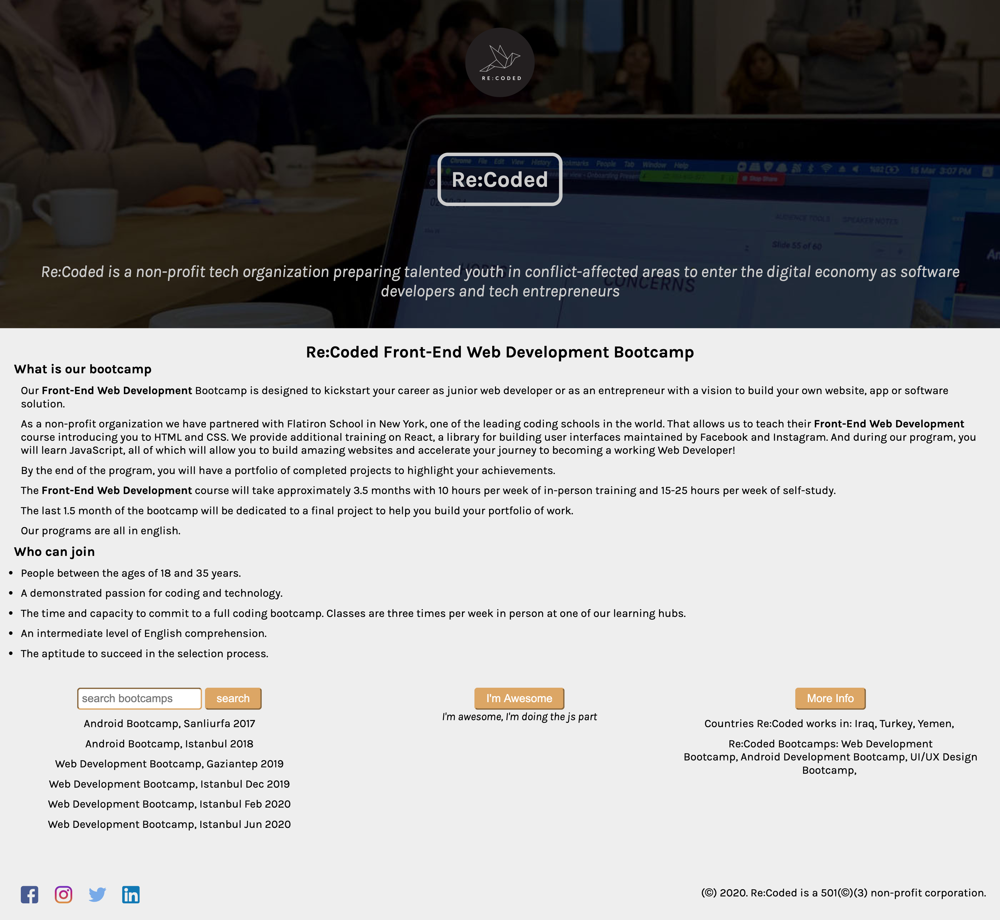
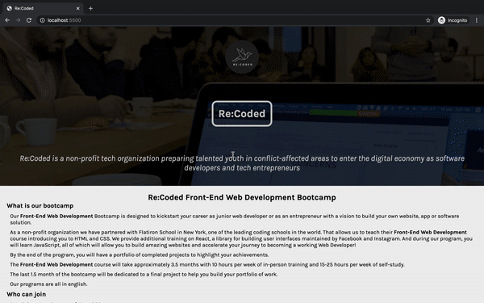

## Find and Fix Errors
No. of errors in HTML & CSS: 10
A web developer was working on a simple website for Re:Coded bootcamps

This simple web page was designed to look like this before the JS part applied:

And like this after JS part applied:

A gif showing how the buttons and hover effect work:

Here are the images links:

    https://drive.google.com/open?id=1_YRh_FeX_owNopgxiz3A2kxWA4YnLHd6
    https://drive.google.com/open?id=1SXLpyAeuEagwKCV7MXMbtPAqW3R2hV1m
    https://drive.google.com/open?id=1kfaSmgcFlNKhvLnYnGr8ZTW5gPae7GyF

But one day, the son of the developer took a hold of the keyboard, made some random HTML and CSS errors, disabled the buttons functionality and asked some questions.

Your responsibility is:

    Check the HTML & CSS code on the left for errors, fix as much as you can to make it appear like the screenshots above, 
    Answer the questions in the comments
    Add the resources you used to answer each question in resources.md file (e.g: add the link you found in Google to your question, or type asked a friend if a friend helped you answering it) so he can look at them himself when he grows up.
    Add the JavaScript code to make the buttons work!
    If you get stuck on one of the requirements, skip it and do other ones, then come back to it at the end.
    If you can't answer a question, try to provide an explanation with why you couldn't determine the answer. 

    You might need to add more HTML elements and/or CSS rules.

    You are required to add as much Javascript code as you can.

